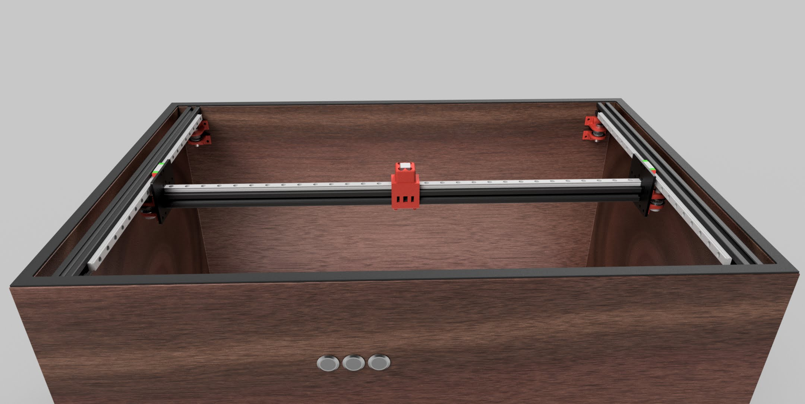

# Zen Table

Each of the following sections is in its own directory with its own `README.md` file and instructions of how to use it.

## [🔩 Build](./build)

- [Photos](https://photos.app.goo.gl/SDqNofCvKbGYkoxy6)
- [Bill of Materials](https://docs.google.com/spreadsheets/d/1nTiWtXSQyJkAH41l_2g4mi9BzdMKPcJyHellGAf7hss/edit?usp=sharing)
- CAD design (TODO)
- Electronics Diagram (TODO)
- Timing belt Diagram (TODO)
- Build Instructions (TODO)

## [💡 ESP-32](./esp32)

- Hosts website (TODO)
- Controls lights (TODO)
- Sends gcode to Mega (TODO)

## [🖥️ Mega](./mega)

- Running Marlin firmware (TODO)
- Controls motors (TODO)
- Receives gcode from ESP32 (TODO)

## 🔗 Resources

- [Another sand table project](https://github.com/rdudhagra/Sand-Table)
- [Pattern generator](https://github.com/markroland/sand-table-pattern-maker)
- [Pattern generator 2](https://github.com/texx00/sandypi)
- [Fusion 360](https://www.autodesk.com/products/fusion-360/overview)
